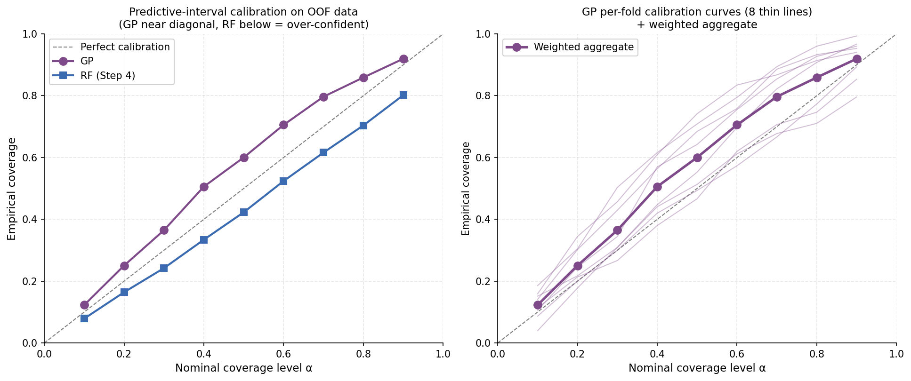
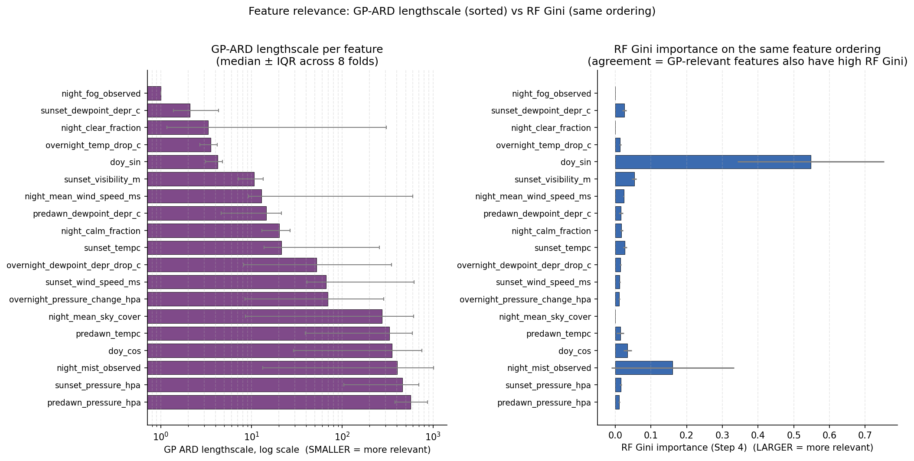
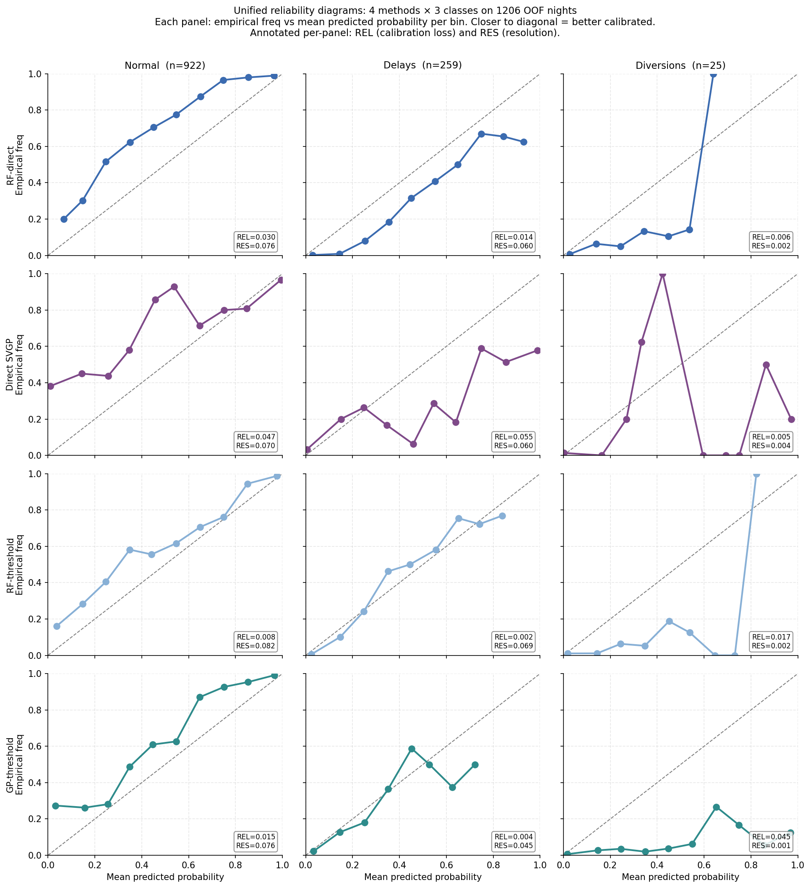
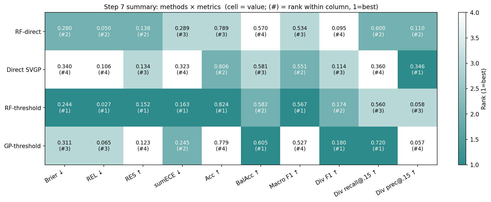
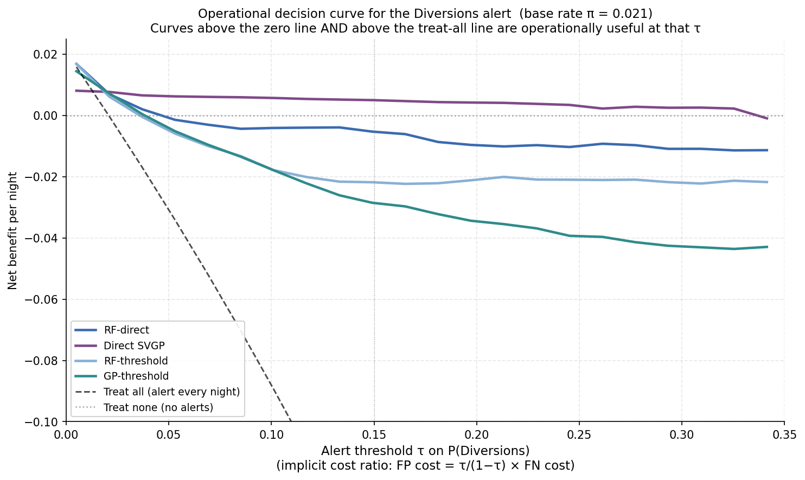

# Bayesian Forecasting of Low-Visibility Events at Tribhuvan International Airport

**A Gaussian Process approach to winter fog diversion risk in Nepal.**


> Coursework submission for STW7085CEM Advanced Machine Learning, Task 1, MSc Data Science and Computational Intelligence, Softwarica College of IT and E-commerce (Coventry University). Authors: Tek Raj Bhatta (Student ID 250069, CUID 16544288), Sachin Manadhar ( Student ID 250137).

---

## Overview

Tribhuvan International Airport (VNKT) is Nepal's sole gateway for international civil aviation. Each winter, dense radiation fog over the Kathmandu Valley drives morning visibility below the airport's published instrument-approach minima, forcing in-bound aircraft to divert to Lucknow, Varanasi, Kolkata or Delhi. This repository contains a fully reproducible probabilistic forecasting pipeline for next-morning visibility at VNKT, framed both as a regression task and as a three-class operational classification task at the ICAO 1600 m and 800 m thresholds.

Eleven winter seasons of METAR observations from the Iowa Environmental Mesonet (2016–2026, 1561 daily-aggregated nights) are used to train and evaluate four predictors under an eight-fold forward-chaining cross-validation protocol:

- **Gaussian Process regression** with a Matérn-5/2 ARD kernel (GPflow exact GP, log-Normal observation likelihood)
- **Sparse variational GP classification** (M = 120 inducing points, RobustMax likelihood)
- **Threshold-derived classification** (class probabilities by integrating the GP regression posterior over operational thresholds)
- **Random Forest** baselines for both regression and classification

## Headline findings

The GP regression posterior achieves near-nominal 90% prediction-interval coverage (**0.920** vs the Random Forest's **0.802**), at the cost of a modest point-accuracy decrement. ARD length-scales recover dewpoint depression and overnight cooling as the dominant continuous predictors, which are the textbook physical drivers of radiation fog that tree-based Gini importance masks behind day-of-year seasonality. Class probabilities derived by integrating the GP regression posterior over the operational visibility thresholds yield **0.72 Diversions recall** at a 15% alert threshold, against 0.60 for the Random Forest classifier and 0.36 for a direct GP classifier. Whether this rare-class advantage is worth its precision cost depends on the deployment cost regime, which a Vickers net-benefit decision curve quantifies.

---

## Featured results

### 1. Regression calibration: GP vs Random Forest

The GP curve hugs the diagonal across every coverage level; the Random Forest curve sits consistently below, indicating systematic over-confidence at every level, not just the headline 90% point.



### 2. ARD feature relevance vs Random Forest Gini

The GP-ARD ranking recovers the physical fog precursors (dewpoint depression, overnight temperature drop) that RF Gini hides behind day-of-year seasonality. The two methods agree on seasonality but disagree on thermodynamic structure.



### 3. Per-class reliability for all four classifiers

Rows are methods; columns are operational classes. Direct SVGP curves are noticeably wilder than the threshold-derived variants. The GP-threshold method is the only one that places meaningful probability mass in the Diversions bins.



### 4. Methods × metrics summary heatmap

RF-threshold dominates the aggregate-calibration columns (Brier, REL, sumECE, Accuracy); GP-threshold dominates the rare-class operational columns (Balanced Accuracy, Diversions F1, Diversions recall at 0.15). There is no single best classifier independent of the cost regime.



### 5. Vickers net-benefit decision curve

A useful classifier sits above both the zero line and the treat-all line at the operational alert threshold. At very low τ all methods are tied; at moderate τ Direct SVGP dominates; at high τ the choice becomes treat-none.



---

## Results at a glance

### Regression (1206 out-of-fold nights)

| Model | MAE (m) | RMSE (m) | R² | 90% PI coverage | PI width (m) |
|---|---:|---:|---:|---:|---:|
| Persistence | 3864 | 4126 | −4.11 | — | — |
| Climatology | 1218 | 1438 | 0.36 | — | — |
| Random Forest | **832** | **1100** | **0.629** | 0.802 | 2774 |
| GP (Matérn-5/2 + ARD) | 956 | 1287 | 0.492 | **0.920** | 5446 |

### Classification (1206 out-of-fold nights)

| Method | Brier | sumECE | Accuracy | BalAcc | DivF1 | Div Recall @ 0.15 |
|---|---:|---:|---:|---:|---:|---:|
| RF-direct | 0.280 | 0.289 | 0.789 | 0.570 | 0.095 | 0.60 |
| Direct SVGP | 0.340 | 0.323 | 0.806 | 0.581 | 0.114 | 0.36 |
| RF-threshold | **0.244** | **0.163** | **0.824** | 0.582 | 0.174 | 0.56 |
| GP-threshold | 0.311 | 0.245 | 0.779 | **0.605** | **0.180** | **0.72** |

### Murphy decomposition

| Method | Brier | REL ↓ | RES ↑ | UNC |
|---|---:|---:|---:|---:|
| RF-direct | 0.280 | 0.050 | 0.138 | 0.369 |
| Direct SVGP | 0.340 | 0.106 | 0.134 | 0.369 |
| RF-threshold | **0.244** | **0.027** | **0.152** | 0.369 |
| GP-threshold | 0.311 | 0.065 | 0.123 | 0.369 |

---

## Dataset

| Property | Value |
|---|---|
| Source | [Iowa Environmental Mesonet ASOS-AWOS-METAR archive](https://mesonet.agron.iastate.edu/request/download.phtml), station VNKT |
| Raw observations | 165,040 (half-hourly, 1 Jan 2016 – 23 May 2026) |
| Winter seasons | 11 (Oct–Feb, 2015/16 through 2025/26) |
| Daily rows after aggregation | 1561 (Oct–Feb only) |
| Target | Minimum visibility, 05:45–09:45 NPT window |
| Classes | Normal (≥1600 m) / Delays-Likely (800–1600 m) / Diversions-Likely (<800 m) |
| Class counts | 1129 / 389 / 43 (72.3% / 24.9% / 2.8%) |
| Features | 19 (sunset/predawn snapshots, overnight evolution, sky state, seasonality) |

Label cross-check: of the 43 nights labelled Diversions, 42 carry independent METAR FG (fog) present-weather codes from the source observation.

---

## Pipeline structure

The pipeline is organised as seven sequential stages, each with a stand-alone Python module under `scripts/` and a Jupyter notebook under `notebooks/` that orchestrates the module and renders the figures shown above.

| Step | Module | Notebook | Output |
|---|---|---|---|
| 1 | `scripts/clean_metar.py` | `notebooks/01_data_cleaning.ipynb` | Cleaned half-hourly observations |
| 2 | `scripts/feature_engineering.py` | `notebooks/02_feature_engineering.ipynb` | Daily-aggregated modelling table (1561 × 25) |
| 3 | `scripts/cv_splits.py` | `notebooks/03_cv_setup.ipynb` | Eight forward-chaining fold definitions |
| 4 | `scripts/baseline_models.py` | `notebooks/04_rf_baselines.ipynb` | RF regression + classification OOF predictions |
| 5 | `scripts/gp_regression.py` | `notebooks/05_gp_regression.ipynb` | GP regression OOF predictions, ARD length-scales |
| 6 | `scripts/gp_classification.py` | `notebooks/06_gp_classification.ipynb` | Direct SVGP + threshold-derived GP OOF predictions |
| 7 | `scripts/calibration_deepdive.py` | `notebooks/07_calibration_deepdive.ipynb` | Cross-model Murphy decomposition + Vickers NB |

---

## Repository layout

```
.
├── data/
│   ├── raw/                          # Source METAR file from IEM (not committed)
│   └── processed/
│       ├── vnkt_modelling_table.parquet
│       ├── rf_oof_predictions.parquet
│       ├── gp_oof_predictions.parquet
│       ├── gp_clf_oof_predictions.parquet
│       ├── step{4,5,6,7}_metrics.json
│       └── step7_tables/
├── notebooks/                        # Step-by-step notebooks (Steps 1–7)
├── scripts/                          # Stand-alone modules called by notebooks
├── reports/
│   ├── figures/                      # All figures rendered by the pipeline
│   └── paper/                        # IEEE conference paper (LaTeX source + PDF)
├── requirements.txt
├── environment.yml
├── LICENSE
└── README.md
```

---

## Reproducing the pipeline

### Environment

The pipeline targets Python 3.10 on Linux. GPflow 2.10 with TensorFlow 2.21 (CPU-only is sufficient) is the only non-trivial dependency.

```bash
# Option 1: venv + pip
python3.10 -m venv venv
source venv/bin/activate
pip install -r requirements.txt

# Option 2: conda
conda env create -f environment.yml
conda activate vnkt-fog
```

### Data

The raw METAR file is excluded from the repository (size, licensing). Download it directly from the Iowa Environmental Mesonet:

```bash
# Replace start/end dates as needed for replication
curl -o data/raw/vnkt_metar_raw.csv \
  "https://mesonet.agron.iastate.edu/cgi-bin/request/asos.py?\
station=VNKT&data=all&year1=2016&month1=1&day1=1&\
year2=2026&month2=5&day2=23&tz=Etc%2FUTC&format=onlycomma&\
latlon=no&missing=M&trace=T&direct=no&report_type=3&report_type=4"
```

### Run the pipeline end to end

```bash
# Sequential execution of all seven steps (~20 minutes on a Ryzen-7 CPU)
jupyter nbconvert --to notebook --execute notebooks/01_data_cleaning.ipynb
jupyter nbconvert --to notebook --execute notebooks/02_feature_engineering.ipynb
jupyter nbconvert --to notebook --execute notebooks/03_cv_setup.ipynb
jupyter nbconvert --to notebook --execute notebooks/04_rf_baselines.ipynb
jupyter nbconvert --to notebook --execute notebooks/05_gp_regression.ipynb    # ~10 min
jupyter nbconvert --to notebook --execute notebooks/06_gp_classification.ipynb # ~2 min
jupyter nbconvert --to notebook --execute notebooks/07_calibration_deepdive.ipynb
```

Each notebook is idempotent and writes its outputs to `data/processed/` and `reports/figures/`. Intermediate parquet files allow individual steps to be re-run without recomputing upstream stages.

### Run a single step interactively

```bash
jupyter lab notebooks/05_gp_regression.ipynb
```

---

## Key design decisions

A short list of the methodological choices that matter for reproducibility:

- **Target transform**: `log(1 + y)` followed by per-fold standardisation, so the GP operates on an approximately Gaussian, unbounded quantity. The point estimate in metres is the median of the back-transformed log-Normal predictive, and 90% PIs are computed by transforming the standardised-log-space Gaussian quantiles back to metres. The resulting interval is asymmetric in metres-space, which is appropriate for visibility.
- **Kernel choice**: Matérn-5/2 (twice mean-square differentiable) over the squared-exponential, on the grounds that surface meteorological fields are widely held to be insufficiently smooth for the latter.
- **Cross-validation**: forward-chaining with growing windows. The 2025/26 season is reserved as a final holdout and never enters cross-validation.
- **Per-fold preprocessing**: median imputation and z-score scaling are fitted on the training subset of each fold only, preventing test-set leakage.
- **ARD interpretation**: two features (`night_fog_observed`, `night_clear_fraction`) are excluded from the relevance reading because their length-scales never move from initialisation or span six orders of magnitude across folds. The remaining seventeen features admit a meaningful comparison.
- **Threshold-derived classification**: class probabilities are obtained by integrating the regression posterior over the operational visibility thresholds, rather than training a separate classifier. The same construction is applied to both the GP and RF regression posteriors for an apples-to-apples comparison.

---

## Paper

The accompanying conference paper (6 pages, IEEE conference format) is in `reports/paper/`:

- `STW7085CEM_Task1_Paper_TekRajBhatta.tex` — LaTeX source
- `STW7085CEM_Task1_Paper_TekRajBhatta.pdf` — compiled PDF

A mapping from each figure and table in the paper to the script that produces it is included in `reports/paper/figure_provenance.md`.

---

## Acknowledgements

METAR data are provided by the [Iowa Environmental Mesonet](https://mesonet.agron.iastate.edu/) at Iowa State University, with original source NOAA NCEI ISD. Operational visibility minima follow ICAO Doc 8168 PANS-OPS (6th ed., 2020). The GP implementation builds on [GPflow](https://www.gpflow.org/); the Random Forest baseline uses [scikit-learn](https://scikit-learn.org/).

This work was submitted in partial fulfilment of the requirements for the MSc Data Science and Computational Intelligence at Softwarica College of IT and E-commerce, affiliated with Coventry University.

---

## Contact

Tek Raj Bhatta — [250069@softwarica.edu.np](mailto:250069@softwarica.edu.np) — [GitHub @tek-raj-bhatta-250069](https://github.com/tek-raj-bhatta-250069)

## Licence

Released under the MIT Licence — see [`LICENSE`](LICENSE) for details. METAR data are subject to the [Iowa Environmental Mesonet terms of use](https://mesonet.agron.iastate.edu/request/download.phtml).
